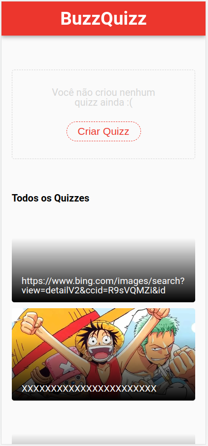
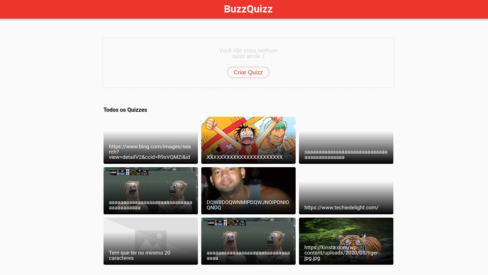

# Project - BuzzQuizz

https://jansenosorio.github.io/buzzquizz/

## Summary 

Esse projeto faz parte do curso da Driven Education . Neste projeto aplicamos nossos conhecimento em HTML, CSS e Javascript, além de consumir <strong>API com Axios</strong>. Criando uma interface dinâmica, com responsividade para Desktop e Mobile. Toda a aplicação foi desenvolvida em grupo, onde aplicamos os conhecimentos de SoftSkills e organização com <strong>Google Calendar</strong> e distribuição de tarefas com o <strong>Trello</strong>.

<p align="center">
  
  
</p>

## Technologies
<p float="left">


</p>

## Axios
### Installing

- Usando NPM: <strong><code>$ npm install axios</code></strong>
- Usando Bower: <strong><code>$ bower install axios</code></strong>
- Usando Yarn: <strong><code>$ yarn add axios</code></strong>
- Usando jsDelivr CDN: <strong><code><script src="https://cdn.jsdelivr.net/npm/axios/dist/axios.min.js"></script></code></strong>
- Usando unpkg CDN: <strong><code><script src="https://unpkg.com/axios/dist/axios.min.js"></script></code></strong>

Documentação completa: <a href="https://axios-http.com/docs/intro">Clique Aqui</a>

### POST Request

Utilizando o <strong>Post Request</strong>

```
  axios.post('/user', {
    firstName: 'Fred',
    lastName: 'Flintstone'
  })
  .then(function (response) {
    console.log(response);
  })
  .catch(function (error) {
    console.log(error);
  });
  ```

### GET Request
```
const axios = require('axios');

// Make a request for a user with a given ID
axios.get('/user?ID=12345')
  .then(function (response) {
    // handle success
    console.log(response);
  })
  .catch(function (error) {
    // handle error
    console.log(error);
  })
  .then(function () {
    // always executed
  });
```

Documentação completa: <a href="https://axios-http.com/docs/intro">Clique Aqui</a>


